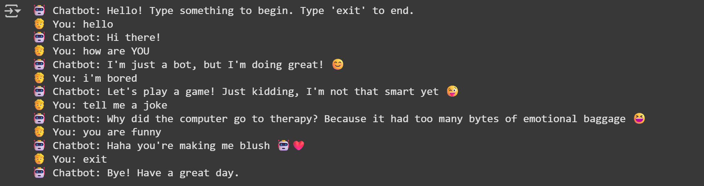

# 💬 Simple Python Chatbot

This is a **simple rule-based chatbot** built using Python. It takes user input via the terminal (or Google Colab), matches it to predefined responses, and replies accordingly.

Perfect for beginners who want to learn how chatbots work without using machine learning or external APIs.

---

## 🧠 How It Works

- The bot listens for user input.
- It compares the input against a dictionary of predefined keywords.
- If a match is found, it returns the corresponding response.
- If not, it replies with a default message: `"I don't understand that."`

---

## 🕹️ How to Use
 ###Run in Google Colab

You can run the chatbot directly in Google Colab without installing anything.

---

## Example Of The Chat

## ُء

